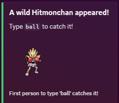
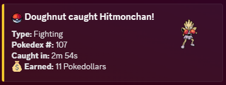

# Mon Bot

A Discord bot that spawns random Pokemon for users to catch! Type `ball` in chat when a Pokemon appears to catch it.

## Features

- 🎮 Random Pokemon spawning in designated channels
- ⚡ Catch Pokemon by typing `ball` in chat
- 🌐 Multi-server support - each Discord server has independent configuration
- 🔧 Admin `/setup` command to configure spawn channels per server
- 📊 Track your caught Pokemon with `/pokedex`
- 🏆 See your collection statistics with `/count`
- 💾 PostgreSQL database for persistent storage
- 🎨 Pokemon data fetched from [PokeAPI](https://pokeapi.co/)

## Quick Start

1. **[Setup Instructions](SETUP.md)** - Complete installation and deployment guide
2. **Invite the bot to your Discord server**
3. **Run `/setup #channel`** to configure where Pokemon spawn
4. **Start catching!** Type `ball` when a Pokemon appears

## Commands

### Admin Commands
- **`/setup #channel`** - Configure which channel(s) Pokemon spawn in (Administrator only)

### User Commands
- **`ball`** - Catch a spawned Pokemon (type in chat when Pokemon appears)
- **`/pokedex [@user]`** - View your Pokedex or another user's
- **`/count`** - See how many of each Pokemon you've caught
- **`/help`** - Display bot commands and information

## How It Works

1. Pokemon randomly spawn in channels you configure with `/setup`
2. Each server administrator can configure their own spawn channels
3. Users catch Pokemon by typing `ball` when they appear
4. All catches are tracked in a PostgreSQL database
5. Each Discord server's data is completely independent

## Screenshots

### When a Pokemon spawns, users see:

### When caught:

## Technology Stack

- **Discord.py** - Discord bot framework with slash commands
- **PokeAPI** - Pokemon data and sprites
- **PostgreSQL** - Persistent database storage (asyncpg)
- **Python 3.8+** - Core programming language

## Deployment

This bot is designed to be easily deployed on:
- **Render.com** (recommended - free tier available)
- **Heroku**
- **Railway**
- **VPS/Self-hosted**

See the [Setup Guide](SETUP.md) for detailed deployment instructions.

## Contributing

Feel free to fork this project and submit pull requests! Some ideas for contributions:
- Additional Pokemon commands (trading, battles, etc.)
- Shiny Pokemon variants
- Evolution mechanics
- Leaderboards
- More customization options

## License

Feel free to use and modify this bot for your own Discord server!

## Credits

- Created by **[DoughnutDev](https://github.com/DoughnutDev)**
- Built with **[Claude Code](https://claude.com/claude-code)** by Anthropic
- Pokemon data from [PokeAPI](https://pokeapi.co/)
- Built with [discord.py](https://github.com/Rapptz/discord.py)

---

**Questions or issues?** Check the [Setup Guide](SETUP.md) or open an issue on GitHub!
